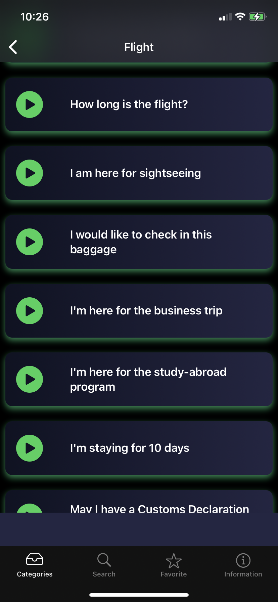

## Disclaimer
-----
First and foremost, it is worth noting that the app is for Japanese users only, as it focuses on teaching Japanese common useful English phrases and how to pronounce them in certain situations.

## Purpose
-----
Especially in recent years, it is quite imperative to be able to speak English if you want to succeed in this very globalized society we live in. Looking at businesses today, it is apparent businesses that have been successful in modern days are the ones that have successfully globlized and expanded beyond their home countries. While Japan is one of the most developed countries of the world, it has not been doing too well when it comes to English education. Specifically, people there are falling behind with their accents. Since clear, verbal communications are crucial in anything, I wanted to build an app that can aid development in that vector.

## Overview
-----

Users can select a situation to focus on and will be navigated to a list of phrases appropriate for the chosen situation. Once they tap on one of the phrases, a modal will be presented with a description about the phrase and when to use it in Japanese. In addition, the green button is there to play a sample pronunciation for practice & for emergency use when travelling.

The landing page is [here](https://eieigo5go.wixsite.com/kogeapp/app-1) (Note: It is mostly written in Japanese as my target audience is Japanese individuals learning English).

You can check out the app on the App Store from [here](https://apps.apple.com/us/app/eigogo/id1526730825).

